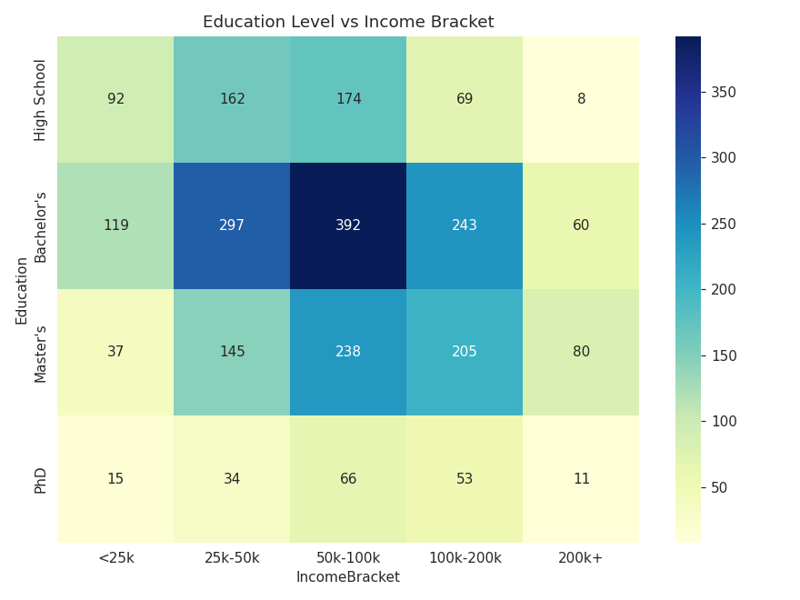

# Customer Demographics Study

A data analytics project exploring customer demographics — age, gender, location, education, income, and spending behavior — across 2,500 customers.

## Project Overview

This project analyzes customer-level data to answer:

- What does the age and gender breakdown of the customer base look like?
- Which cities have the most customers?
- How is income distributed across the customer base?
- Does education level correlate with income?
- Which membership tier drives the most spend?

## Tech Stack

- Python 3
- pandas, numpy — data processing
- matplotlib, seaborn — visualization
- Jupyter Notebook

## Project Structure

```
customer-demographics-study/
├── data/
│   └── customer_data.csv             # Sample customer dataset (2,500 records)
├── notebooks/
│   └── customer_demographics_analysis.ipynb   # Full analysis with code, charts & insights
├── charts/
│   ├── 01_age_distribution.png
│   ├── 02_gender_distribution.png
│   ├── 03_customers_by_city.png
│   ├── 04_income_distribution.png
│   ├── 05_spend_by_membership.png
│   └── 06_education_vs_income.png
├── generate_data.py                   # Script to generate the sample dataset
├── analyze.py                         # Standalone script to run full analysis & export charts
└── README.md
```

## How to Run

```bash
pip install pandas numpy matplotlib seaborn jupyter

# (optional) regenerate the sample dataset
python generate_data.py

# run the full analysis and export charts
python analyze.py

# or explore interactively
jupyter notebook notebooks/customer_demographics_analysis.ipynb
```

## Key Insights

- The customer base averages **34 years old**, skewing toward a working-age population.
- Gender split is nearly even between Male and Female customers (~49% each).
- **Mumbai** has the largest customer concentration, followed by Delhi and Bangalore.
- Higher education levels (Master's, PhD) correlate with higher income brackets.
- **Platinum** tier members have the highest average annual spend, confirming membership tier is a strong proxy for customer value.

## Sample Visualization



---
*Project 2 of 4 — CodTech Data Analytics Internship*
